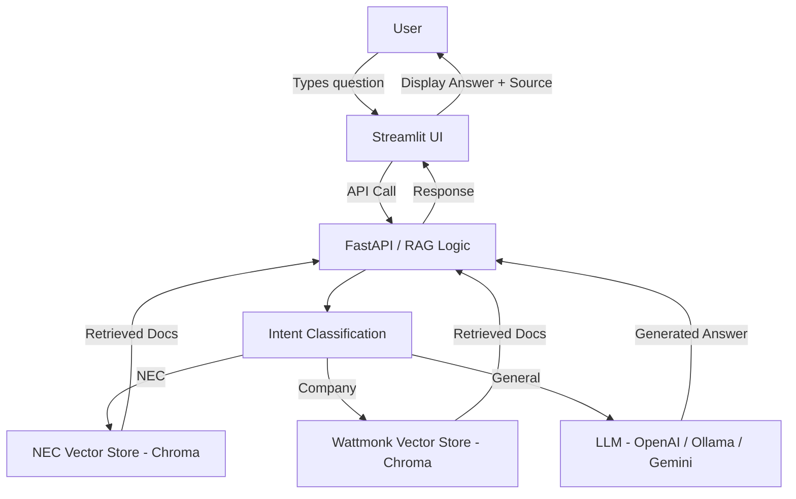

# RAG-Based Chatbot

A **Retrieval-Augmented Generation (RAG)** chatbot that can answer:

* General queries (via LLM)
* NEC code guidelines (from `414.pdf`)
* Company-specific queries (from Wattmonk PDFs)

---

## 📁 Project Structure

```
rag-chatbot/
│
├── app/                  # Backend code
│   ├── main.py
│   ├── rag.py
│   ├── vectorstore.py
│   └── ...
│
├── frontend/             # Streamlit frontend
│   └── app.py
│
├── data/                 # PDF knowledge sources
│   ├── 414.pdf
│   ├── Wattmonk (1) (1) (1).pdf
│   └── Wattmonk Information (1).pdf
│
├── chroma_db/            # Precomputed embeddings (for fast loading)
├── .env                  # API keys (DO NOT commit to GitHub)
├── requirements.txt
└── README.md
```

---

## ⚙️ Installation

1. Clone the repository:

```bash
git clone <repo-url>
cd rag-chatbot
```

2. Create and activate a virtual environment:

**Mac/Linux:**

```bash
python -m venv .venv
source .venv/bin/activate
```

**Windows:**

```bash
python -m venv .venv
.venv\Scripts\activate
```

3. Install dependencies:

```bash
pip install -r requirements.txt
```

4. Create a `.env` file and add your API key(s):

```env
OPENAI_API_KEY=your_api_key_here
```

> You can replace OpenAI with other providers (Gemini, Ollama, etc.) by modifying `llm.py`.

---

## ▶️ Running the Application

### 1. Start Backend (FastAPI)
run
```bash
# Mac/Linux
source .venv/bin/activate

# Windows
.venv\Scripts\activate
```
then run
```bash
uvicorn app.main:app --reload
```
or
```bash
python3 -m uvicorn app.main:app --reload
```

### 2. Start Frontend (Streamlit)

```bash
streamlit run frontend/app.py
```
or
```bash
python3 -m streamlit run frontend/app.py
```
---

## 🧠 Architecture



---

## ✨ Features

* Multi-context handling (General, NEC, Wattmonk)
* Source attribution for answers
* Multi-turn conversation support
* Fallback responses for unknown queries

---

## 🧪 Notes

* This app was tested using **Ollama (Llama 3.2)**.
* You can use your own API key (OpenAI, Gemini, etc.).
* To change the LLM provider, update the `llm.py` and the `config.py` files accordingly.

---

## 🔐 Security Best Practices

* Never commit `.env` files to GitHub
* Keep API keys secure using environment variables
* Use `.gitignore` to exclude sensitive files

---

## 🚀 Deployment Checklist

* [ ] Working deployed application with public URL
* [ ] Environment variables properly configured
* [ ] API keys secured (not exposed in code)
* [ ] Responsive design for mobile devices
* [ ] Error handling and user feedback
* [ ] Loading states for better UX
* [ ] Logs or monitoring enabled

---
